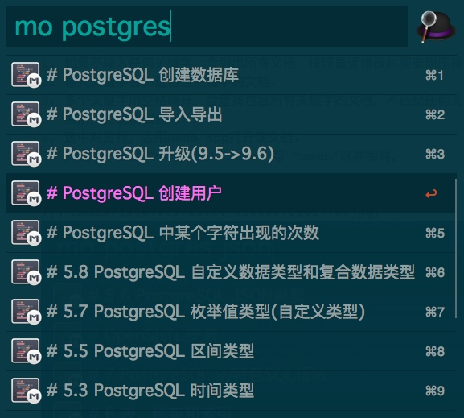
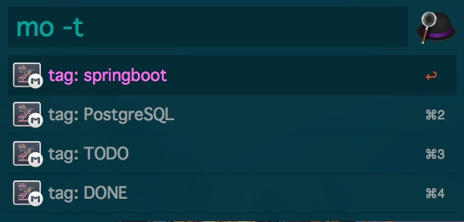
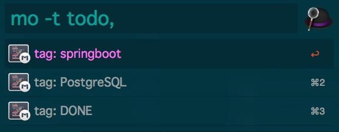
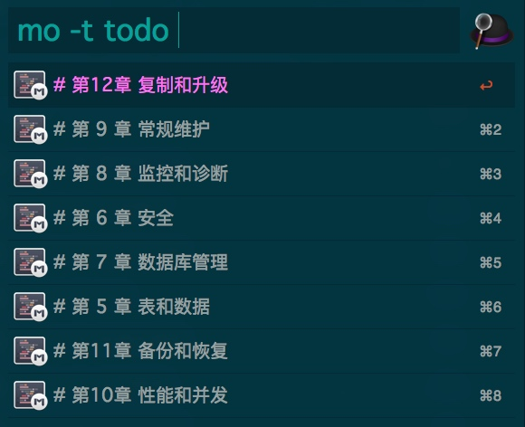

# MWeb workflow
[下载](https://github.com/tianhao/alfred-mweb-workflow/raw/master/MWeb.alfredworkflow)

使用前请参照最后一节 "设置环境变量" 配置

## 搜索&打开文档


使用方法:
用户可以使用关键字 "mo" 或者自定义快捷键触发 workflow

```
mo [-t tag1,tag2...] [keyword1] [keyword2]...
hotkey-> [-t tag1,tag2...] [keyword1] [keyword2]...
```

示例

```BASH
# 不输入任何参数，按最近修改时间排序文档
mo 
# 查找有 alfred 关键字的文档
mo alfred
# 查找有 alfred 和 workflow 两个关键字的文档
mo alfred workflow
# 查找tag含有 TODO 的文档，tag不区分大小写
mo -t TODO
# 查找tag同时包含 TODO 和 DONE 的文档, tag之间以,隔开(中文逗号，也可以)，但tag名称不能有空格
mo -t TODO,DONE
# 查找 tag含有 TODO, 且有alfred 和 workflow 两个关键字的文档
mo -t TODO alfred workflow
# 与上面输入等效
mo alfred workflow -t TODO 
```

功能说明：

1. 如果不输入任何参数，会列出最近修改过的20个文档，按照最近修改时间安倒序排序，即使输入了参数筛选，也最多输出20条记录；
2. 目前支持2种可选筛选参数，tag参数(-t)和关键字参数，会根据参数筛选文档并做好排序,tag筛选参考下面[tag筛选]；
3. 你可以输入多个关键字筛选，中间以空格隔开，workflow 会用查找包含所有关键的的文档，只有包含所有关键字的文档才会列出来，所以关键字越多越精确；
4. 选中对应行，回车，会用MWeb app打开该文档；
5. 关键字不区分大小写，输入"MWeb" 与 "mweb"效果相同。

tag筛选：

1. 输入 `-t tag1[,tag2...]` 触发workflow查找包含所有输入tag的文档，同样，只有包含所有输入tag的文档才会显示；
2. tag之间以逗号","隔开，tag不区分大小写，逗号也不区分中英文；
3. 当输入-t 时，workflow会显示可选的tag选项方便输入你继续完成输入，仅仅时为了提示输入，这时不要回车，回车就结束了流程，不会打开文档；
4. tag输入完成最后输入空格终止tag输入，这时会显示筛选出来的文档；这时回车会打开文档；

不带关键字，列出前20个最近改过的文档


一个关键字



多个关键字


tag列表: `-t` 触发 tag 选项



tag列表：输入一个tag后，输入下一个tag前会将上一个从列表剔除



tag输入完成再输入一个空格，会展示tag筛选结果



tag(todo) 和 关键字(pg_) 组合筛选文档


## "mpush" (提交生成的静态博客到远端Git(Hub)
我用的是GitHub做静态博客，在用MWeb生成网站之后，需要做 git add ...;  git commit ;git push等一序列操作才能把最新文章推送到GitHub，博客才更新，所以做了一个一键push功能

使用方法：

1. 按设置环境变量的方法设置 MBLOG_HOME 变量 MBLOG_URL变量(一次性)
2. 用MWeb生成生成网站
3. 使用mpush 一键推送到GitHub或者别的远程git地址
4. push完成之后会打开博客地址(用浏览器)

静态博客使用方法请参考 MWeb 官方文档，这里只是做了一键push操作


## 设置环境变量(必须设置)

1. 打开MWeb workflow 的环境变量设置页面


2. 打开MWeb偏好设置,复制对应路径到workflow变量中


MBLOG_URL 填上的你Blog地址(如果使用了MWeb的静态博客功能)


3. 设置快捷键（可选）

workflow 默认没有设置 mo 和 mpush 的快捷键，用户可以按照自己的需要设置快捷键


