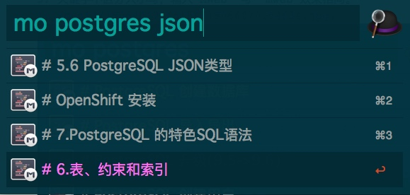

# MWeb workflow
[下载](https://github.com/tianhao/alfred-mweb-workflow/raw/master/MWeb.alfredworkflow)

使用前请参照最后一节 "设置环境变量" 配置

## "mo [关键字1] [关键字2]..." (搜索&打开文档)

用户可以使用关键字 "mo" 或者自定义快捷键触发 workflow

* mo [关键字1] [关键字2]...
* hotkey-> [关键字1] [关键字2]...

功能说明：

1. 如果不输入任何关键字，会列出所有文档，按照最近修改时间安倒序排序；
2. 输入关键字会筛选包含关键字的文档；
3. 多个关键字用空格隔开，会查找包含所有关键字的文档，不匹配任何关键字或只匹配部分关键字的文档不会展示，方便精准查询；
4. 选中对应行，回车，会用MWeb app打开该文档；
5. 关键字不区分大小写，输入"MWeb" 与 "mweb"效果相同。

不带关键字，列出所有文档

一个关键字

多个关键字

## "mpush" (提交生成的静态博客到远端Git(Hub)
我用的是GitHub做静态博客，在用MWeb生成网站之后，需要做 git add ...;  git commit ;git push等一序列操作才能把最新文章推送到GitHub，博客才更新，所以做了一个一键push功能

使用方法：

1. 按设置环境变量的方法设置 MBLOG_HOME 变量 MBLOG_URL变量(一次性)
2. 用MWeb生成生成网站
3. 使用mpush 一键推送到GitHub或者别的远程git地址
4. push完成之后会打开博客地址(用浏览器)

静态博客使用方法请参考 MWeb 官方文档，这里只是做了一键push操作

## 设置环境变量(必须设置)

1. 打开MWeb workflow 的环境变量设置页面

2. 打开MWeb偏好设置,复制对应路径到workflow变量中

MBLOG_URL 填上的你Blog地址(如果使用了MWeb的静态博客功能)

3. 设置快捷键（可选）

workflow 默认没有设置 mo 和 mpush 的快捷键，用户可以按照自己的需要设置快捷键

